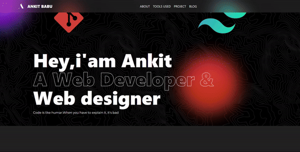

# ⚡Developer Portfolio Website

Welcome to my portfolio website repository! This website is built using **HTML**, **Tailwind CSS**, **JavaScript**, **GSAP**, and **FontAwesome icons** to showcase my work, skills, and projects. Feel free to explore, contribute, and get inspired!


## 🛠️ Tech Stack

- **HTML5**: For the structure of the website
- **Tailwind CSS**: For responsive, utility-first styling
- **JavaScript**: For adding interactivity
- **GSAP (GreenSock Animation Platform)**: For smooth and advanced animations
- **FontAwesome**: For icons

## 🚀 Features

- **Fully Responsive**: Optimized for different screen sizes (mobile, tablet, and desktop).
- **Animations**: Smooth animations using GSAP to enhance user experience.
- **Projects Section**: Displays projects with descriptions, technologies used, and live demo links.
- **Skills Section**: Shows a list of technical skills with progress indicators.
- **Contact Form**: A working contact form using a backend service (like EmailJS).
- **Social Media Links**: Quick access to my social media profiles.


## 💻 How to Run Locally

Follow these steps to run the project on your local machine:

1. Clone this repository:
   ```bash
   git-clone https://github.com/Cipher-Soul/Modern_webpage.git


